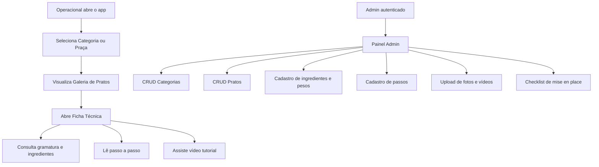
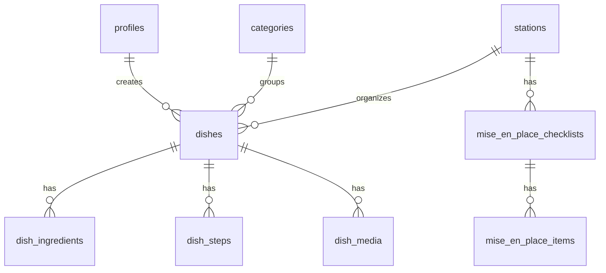

# Objetivo

Definir a arquitetura completa de um aplicativo **PWA responsivo** para **Gestão Operacional e Padronização** do **COTI Restaurante**, com foco em **sucessão de conhecimento operacional**: qualquer colaborador novo deve conseguir reproduzir montagem, gramatura e produção dos pratos seguindo fichas técnicas e vídeos tutoriais no app.

**Stack fixa:** `Next.js 14 (App Router)` + `Tailwind CSS` + `Supabase (Auth, Database, Storage)`

**Perfis:**
- **Admin**: login/senha, CRUD completo, upload de fotos e vídeos.
- **Operacional**: sem senha, navegação livre, visualização de fichas técnicas e reprodução de vídeos.

---

## 1) Arquitetura da solução

### Visão geral

A solução será composta por três camadas principais:

1. **Frontend PWA em Next.js 14**
   - Interface responsiva para tablets e smartphones.
   - App Router para separar áreas pública/operacional e administrativa.
   - Tailwind CSS para design consistente com paleta azul, branco e bege.
   - Service Worker e manifest para uso como PWA.

2. **Backend BaaS com Supabase**
   - **Auth** para autenticação apenas do perfil Admin.
   - **Postgres** para modelagem de pratos, categorias, praças, ingredientes, passos, checklists e mídia.
   - **Storage** para imagens, vídeos e thumbnails.

3. **Distribuição operacional orientada por conteúdo**
   - Navegação: **Categorias → Galeria de Pratos → Ficha Técnica → Tutorial em vídeo**.
   - Organização adicional por **Praça** e por **Checklist de Mise en Place**.

### Fluxo funcional



### Diretrizes arquiteturais

- **Separação clara entre conteúdo operacional e gestão**.
- **Dados normalizados no banco**, com composição no frontend via consultas agregadas.
- **Uploads desacoplados do conteúdo textual**, para permitir reprocessamento e otimização futura.
- **Leitura operacional extremamente simples**, com foco em toque rápido, contraste e baixa fricção.
- **Administração orientada por formulários estruturados**, reduzindo inconsistência na entrada de dados.

---

## 2) Estrutura de pastas do projeto

```text
.
├─ PLAN.md
├─ public/
│  ├─ icons/
│  ├─ images/
│  ├─ manifest.webmanifest
│  └─ offline/
├─ src/
│  ├─ app/
│  │  ├─ (public)/
│  │  │  ├─ page.tsx
│  │  │  ├─ categorias/
│  │  │  │  ├─ page.tsx
│  │  │  │  └─ [slug]/page.tsx
│  │  │  ├─ pracas/
│  │  │  │  ├─ page.tsx
│  │  │  │  └─ [slug]/page.tsx
│  │  │  ├─ pratos/
│  │  │  │  └─ [slug]/page.tsx
│  │  │  └─ checklist/
│  │  │     ├─ page.tsx
│  │  │     └─ [pracaSlug]/page.tsx
│  │  ├─ admin/
│  │  │  ├─ login/page.tsx
│  │  │  ├─ layout.tsx
│  │  │  ├─ page.tsx
│  │  │  ├─ categorias/
│  │  │  │  ├─ page.tsx
│  │  │  │  ├─ novo/page.tsx
│  │  │  │  └─ [id]/page.tsx
│  │  │  ├─ pracas/
│  │  │  │  ├─ page.tsx
│  │  │  │  ├─ novo/page.tsx
│  │  │  │  └─ [id]/page.tsx
│  │  │  ├─ pratos/
│  │  │  │  ├─ page.tsx
│  │  │  │  ├─ novo/page.tsx
│  │  │  │  └─ [id]/page.tsx
│  │  │  └─ checklists/
│  │  │     ├─ page.tsx
│  │  │     ├─ novo/page.tsx
│  │  │     └─ [id]/page.tsx
│  │  ├─ api/
│  │  │  ├─ media/upload/route.ts
│  │  │  └─ revalidate/route.ts
│  │  ├─ globals.css
│  │  ├─ layout.tsx
│  │  └─ not-found.tsx
│  ├─ components/
│  │  ├─ ui/
│  │  │  ├─ button.tsx
│  │  │  ├─ card.tsx
│  │  │  ├─ input.tsx
│  │  │  ├─ textarea.tsx
│  │  │  ├─ dialog.tsx
│  │  │  ├─ badge.tsx
│  │  │  └─ tabs.tsx
│  │  ├─ layout/
│  │  │  ├─ app-shell.tsx
│  │  │  ├─ topbar.tsx
│  │  │  ├─ bottom-nav.tsx
│  │  │  └─ section-header.tsx
│  │  ├─ categorias/
│  │  │  ├─ category-grid.tsx
│  │  │  └─ category-card.tsx
│  │  ├─ pracas/
│  │  │  ├─ station-grid.tsx
│  │  │  └─ station-card.tsx
│  │  ├─ pratos/
│  │  │  ├─ dish-gallery.tsx
│  │  │  ├─ dish-card.tsx
│  │  │  ├─ dish-hero.tsx
│  │  │  ├─ ingredient-table.tsx
│  │  │  ├─ preparation-steps.tsx
│  │  │  ├─ technical-sheet.tsx
│  │  │  └─ tutorial-player.tsx
│  │  ├─ checklist/
│  │  │  ├─ checklist-list.tsx
│  │  │  └─ checklist-card.tsx
│  │  └─ admin/
│  │     ├─ admin-shell.tsx
│  │     ├─ admin-sidebar.tsx
│  │     ├─ dish-form.tsx
│  │     ├─ ingredient-field-array.tsx
│  │     ├─ preparation-steps-editor.tsx
│  │     ├─ media-upload.tsx
│  │     ├─ category-form.tsx
│  │     ├─ station-form.tsx
│  │     └─ checklist-form.tsx
│  ├─ lib/
│  │  ├─ supabase/
│  │  │  ├─ browser.ts
│  │  │  ├─ server.ts
│  │  │  └─ middleware.ts
│  │  ├─ auth/
│  │  │  └─ guards.ts
│  │  ├─ queries/
│  │  │  ├─ categorias.ts
│  │  │  ├─ pracas.ts
│  │  │  ├─ pratos.ts
│  │  │  └─ checklists.ts
│  │  ├─ actions/
│  │  │  ├─ categorias.ts
│  │  │  ├─ pracas.ts
│  │  │  ├─ pratos.ts
│  │  │  └─ checklists.ts
│  │  ├─ validations/
│  │  │  ├─ categoria.ts
│  │  │  ├─ praca.ts
│  │  │  ├─ prato.ts
│  │  │  └─ checklist.ts
│  │  ├─ constants/
│  │  │  ├─ theme.ts
│  │  │  └─ app.ts
│  │  ├─ pwa/
│  │  │  ├─ manifest.ts
│  │  │  └─ offline-cache.ts
│  │  └─ utils.ts
│  ├─ types/
│  │  ├─ database.ts
│  │  ├─ dish.ts
│  │  ├─ checklist.ts
│  │  └─ media.ts
│  └─ middleware.ts
├─ supabase/
│  ├─ migrations/
│  ├─ seed.sql
│  └─ storage-policies.sql
├─ docs/
│  ├─ arquitetura.md
│  ├─ conteudo-operacional.md
│  └─ padrao-de-midias.md
├─ tailwind.config.ts
├─ next.config.js
├─ package.json
└─ tsconfig.json
```

### Convenções de organização

- `app/(public)` concentra a experiência operacional sem autenticação.
- `app/admin` concentra rotas protegidas por autenticação.
- `components/pratos` e `components/admin` isolam responsabilidades de leitura e edição.
- `lib/queries` contém leitura de dados; `lib/actions` concentra mutações do painel admin.
- `supabase/migrations` centraliza versionamento do schema e políticas.

---

## 3) Schema do banco de dados (Supabase/Postgres)

### Entidades principais

#### `profiles`
Extensão do usuário autenticado do Supabase para admins.

| Campo | Tipo | Regras |
|---|---|---|
| id | uuid | PK, referência a `auth.users.id` |
| full_name | text | not null |
| role | text | check in (`admin`) |
| created_at | timestamptz | default now() |

#### `stations`
Representa as praças operacionais.

| Campo | Tipo | Regras |
|---|---|---|
| id | uuid | PK |
| name | text | unique, not null |
| slug | text | unique, not null |
| description | text | null |
| display_order | int | default 0 |
| is_active | boolean | default true |
| created_at | timestamptz | default now() |
| updated_at | timestamptz | default now() |

#### `categories`
Categorias de pratos.

| Campo | Tipo | Regras |
|---|---|---|
| id | uuid | PK |
| name | text | unique, not null |
| slug | text | unique, not null |
| description | text | null |
| cover_image_path | text | null |
| display_order | int | default 0 |
| is_active | boolean | default true |
| created_at | timestamptz | default now() |
| updated_at | timestamptz | default now() |

#### `dishes`
Cadastro mestre dos pratos.

| Campo | Tipo | Regras |
|---|---|---|
| id | uuid | PK |
| category_id | uuid | FK `categories.id`, not null |
| station_id | uuid | FK `stations.id`, not null |
| name | text | not null |
| slug | text | unique, not null |
| short_description | text | null |
| yield_info | text | null |
| plating_notes | text | null |
| prep_time_minutes | int | null |
| serves_quantity | numeric(10,2) | null |
| hero_image_path | text | null |
| thumbnail_path | text | null |
| is_published | boolean | default false |
| is_active | boolean | default true |
| created_by | uuid | FK `profiles.id` |
| updated_by | uuid | FK `profiles.id` |
| created_at | timestamptz | default now() |
| updated_at | timestamptz | default now() |

#### `dish_ingredients`
Ingredientes e gramaturas por prato.

| Campo | Tipo | Regras |
|---|---|---|
| id | uuid | PK |
| dish_id | uuid | FK `dishes.id`, on delete cascade |
| ingredient_name | text | not null |
| quantity | numeric(10,3) | not null |
| unit | text | not null |
| preparation_note | text | null |
| display_order | int | default 0 |
| created_at | timestamptz | default now() |

#### `dish_steps`
Passo a passo do preparo/montagem.

| Campo | Tipo | Regras |
|---|---|---|
| id | uuid | PK |
| dish_id | uuid | FK `dishes.id`, on delete cascade |
| title | text | null |
| instruction | text | not null |
| time_hint | text | null |
| image_path | text | null |
| display_order | int | default 0 |
| created_at | timestamptz | default now() |

#### `dish_media`
Mídias relacionadas ao prato.

| Campo | Tipo | Regras |
|---|---|---|
| id | uuid | PK |
| dish_id | uuid | FK `dishes.id`, on delete cascade |
| media_type | text | check in (`image`, `video`, `thumbnail`) |
| storage_bucket | text | not null |
| storage_path | text | not null |
| file_name | text | not null |
| mime_type | text | not null |
| file_size_bytes | bigint | null |
| duration_seconds | int | null |
| is_primary | boolean | default false |
| created_at | timestamptz | default now() |

#### `mise_en_place_checklists`
Cabeçalho de checklist por praça.

| Campo | Tipo | Regras |
|---|---|---|
| id | uuid | PK |
| station_id | uuid | FK `stations.id`, not null |
| title | text | not null |
| description | text | null |
| shift | text | check in (`abertura`, `producao`, `fechamento`) |
| is_active | boolean | default true |
| created_at | timestamptz | default now() |
| updated_at | timestamptz | default now() |

#### `mise_en_place_items`
Itens do checklist.

| Campo | Tipo | Regras |
|---|---|---|
| id | uuid | PK |
| checklist_id | uuid | FK `mise_en_place_checklists.id`, on delete cascade |
| item_label | text | not null |
| item_description | text | null |
| display_order | int | default 0 |
| is_required | boolean | default true |
| created_at | timestamptz | default now() |

### Relacionamentos



### Índices recomendados

- `categories(slug)` unique
- `stations(slug)` unique
- `dishes(slug)` unique
- `dishes(category_id, is_published, is_active)`
- `dishes(station_id, is_published, is_active)`
- `dish_ingredients(dish_id, display_order)`
- `dish_steps(dish_id, display_order)`
- `mise_en_place_checklists(station_id, shift, is_active)`
- `mise_en_place_items(checklist_id, display_order)`

### Views recomendadas

#### `public_dish_cards`
View para listagem rápida na galeria, trazendo:
- `dish_id`
- `dish_name`
- `dish_slug`
- `category_name`
- `station_name`
- `thumbnail_path`
- `short_description`

#### `public_dish_details`
View ou função RPC para ficha técnica completa, agregando:
- dados do prato
- ingredientes ordenados
- passos ordenados
- links das mídias principais

---

## 4) Componentes principais e responsabilidades

### Camada pública/operacional

#### `AppShell`
- Estrutura principal de navegação no PWA.
- Controla header, área de conteúdo e navegação inferior em telas menores.

#### `CategoryGrid` / `CategoryCard`
- Lista visual de categorias.
- Exibe capa, nome e quantidade de pratos publicados.

#### `StationGrid` / `StationCard`
- Atalho por praça operacional.
- Facilita uso por equipes segmentadas (Fogão, Garde Manger, Confeitaria).

#### `DishGallery` / `DishCard`
- Exibe galeria de pratos filtrados por categoria ou praça.
- Mostra thumbnail, nome, resumo e indicador de vídeo disponível.

#### `TechnicalSheet`
- Componente central da ficha técnica.
- Consolida gramatura, ingredientes, rendimento, observações e montagem.

#### `IngredientTable`
- Tabela legível para ambiente de cozinha.
- Exibe ingrediente, quantidade, unidade e observações.

#### `PreparationSteps`
- Passo a passo ordenado.
- Prioriza leitura sequencial e visual simplificado.

#### `TutorialPlayer`
- Player de vídeo otimizado para rede interna/móvel.
- Suporta poster/thumbnail, controles grandes e fallback se vídeo não carregar.

#### `ChecklistList` / `ChecklistCard`
- Exibição de checklists por praça e turno.
- Uso apenas como consulta operacional na primeira versão.

### Camada administrativa

#### `AdminShell`
- Estrutura protegida do painel administrativo.
- Sidebar, topo, breadcrumbs e ações rápidas.

#### `DishForm`
- Formulário principal de prato.
- Administra nome, categoria, praça, descrição, rendimento e status de publicação.

#### `IngredientFieldArray`
- Lista dinâmica para ingredientes com gramatura e unidade.
- Garante ordenação e consistência dos campos.

#### `PreparationStepsEditor`
- Editor de passos numerados.
- Permite anexar imagem por etapa, quando necessário.

#### `MediaUpload`
- Upload de fotos, thumbnails e vídeos.
- Mostra progresso, preview, status de processamento e seleção da mídia principal.

#### `CategoryForm`, `StationForm`, `ChecklistForm`
- CRUD isolado para entidades auxiliares.
- Mantém baixo acoplamento entre módulos do admin.

### Camada de dados e domínio

#### `lib/queries/*`
- Leitura de conteúdo público e administrativo.
- Centraliza filtros de publicação, ordenação e composição de dados.

#### `lib/actions/*`
- Server Actions ou handlers de mutação.
- Encapsulam validações, persistência e regras de autorização.

#### `lib/validations/*`
- Schemas de validação para formulários.
- Evitam dados inconsistentes no banco.

#### `lib/auth/guards.ts`
- Garante acesso restrito ao admin.
- Faz checagem de sessão e role.

---

## 5) Fases de implementação (ordem de build)

### Fase 1 — Fundação do projeto
**Objetivo:** estabelecer base técnica e visual.

**Entregas:**
- Inicialização do projeto Next.js 14 com App Router.
- Configuração do Tailwind com tema azul, branco e bege.
- Setup do Supabase client/server.
- Estrutura inicial de rotas públicas e admin.
- Configuração PWA (manifest, ícones, instalação, base offline).

**Validação:**
- Aplicação abre em navegador mobile.
- Layout responsivo funcional.
- Instalação como PWA disponível.

### Fase 2 — Modelagem de dados e segurança base
**Objetivo:** criar fundação persistente e segura.

**Entregas:**
- Migrations do schema.
- Seeds iniciais para praças e categorias.
- Buckets de storage.
- Políticas RLS para leitura pública e escrita admin.

**Validação:**
- Banco criado sem conflitos.
- Conteúdo público pode ser lido conforme regras.
- Rotas admin exigem autenticação.

### Fase 3 — Experiência operacional pública
**Objetivo:** entregar fluxo principal de consulta operacional.

**Entregas:**
- Home operacional.
- Navegação por categoria.
- Navegação por praça.
- Galeria de pratos.
- Ficha técnica com ingredientes, gramatura e passo a passo.
- Player de vídeo integrado.
- Checklists por praça.

**Validação:**
- Fluxo completo: categoria → prato → ficha → vídeo.
- Boa legibilidade em tablet e smartphone.
- Conteúdo publicado carregando corretamente.

### Fase 4 — Painel administrativo
**Objetivo:** permitir autonomia de cadastro e manutenção.

**Entregas:**
- Login admin.
- Dashboard administrativo.
- CRUD de categorias.
- CRUD de praças.
- CRUD de pratos.
- CRUD de checklists.
- Upload e vínculo de mídias.

**Validação:**
- Admin cria prato completo com ingredientes, passos e vídeo.
- Item publicado aparece no fluxo operacional.

### Fase 5 — Otimização de mídia e performance
**Objetivo:** garantir fluidez em ambiente real de cozinha.

**Entregas:**
- Thumbnails para todos os vídeos.
- Estratégia de lazy loading.
- Cache de assets críticos.
- Compressão e convenções de resolução.
- Skeleton states e fallback offline parcial.

**Validação:**
- Galeria carrega rápido.
- Vídeo inicia com latência reduzida.
- Páginas principais permanecem funcionais em rede instável.

### Fase 6 — Refinos operacionais e governança de conteúdo
**Objetivo:** elevar confiabilidade da padronização.

**Entregas:**
- Status de publicação e rascunho.
- Validação obrigatória de campos críticos.
- Ordenação manual por categoria e praça.
- Documentação de cadastro e padrão editorial.

**Validação:**
- Conteúdo entra em produção com consistência.
- Novos pratos seguem mesmo padrão de ficha técnica.

---

## 6) Políticas de segurança (RLS Supabase)

### Princípios

- **Operacional sem senha**: somente leitura de conteúdo publicado e ativo.
- **Admin autenticado**: leitura e escrita completas apenas para usuários com role `admin`.
- **Storage segregado**: políticas específicas por bucket e por operação.
- **Nada não publicado deve aparecer no fluxo público**.

### Estratégia de autenticação

- Apenas a área `/admin` usa Supabase Auth.
- Usuários administrativos são cadastrados em `auth.users` e espelhados em `profiles`.
- O papel (`role`) será resolvido em `profiles`.

### Políticas por tabela

#### `profiles`
- `select`: apenas o próprio usuário autenticado e administradores.
- `insert/update`: somente processos administrativos ou usuário autenticado no próprio registro.

#### `categories`
- **Público**: `select` somente quando `is_active = true`.
- **Admin**: `insert/update/delete/select` completo.

#### `stations`
- **Público**: `select` somente quando `is_active = true`.
- **Admin**: CRUD completo.

#### `dishes`
- **Público**: `select` apenas quando `is_active = true` e `is_published = true`.
- **Admin**: CRUD completo.

#### `dish_ingredients`, `dish_steps`, `dish_media`
- **Público**: `select` somente se vinculados a prato `ativo + publicado`.
- **Admin**: CRUD completo.

#### `mise_en_place_checklists`, `mise_en_place_items`
- **Público**: `select` quando checklist estiver ativo e praça ativa.
- **Admin**: CRUD completo.

### Helper de autorização recomendado

Criar uma função SQL auxiliar:

- `is_admin(auth.uid()) -> boolean`

Ela consulta `profiles.role = 'admin'` para simplificar políticas RLS.

### Storage buckets sugeridos

- `dish-images`
- `dish-videos`
- `dish-thumbnails`
- `step-images`
- `category-covers`

### Políticas de storage

- **Leitura pública** para:
  - imagens de pratos publicados
  - thumbnails
  - vídeos de pratos publicados
- **Upload/replace/delete** apenas para admins autenticados.
- Pastas organizadas por entidade:
  - `dishes/{dish_id}/hero/...`
  - `dishes/{dish_id}/videos/...`
  - `dishes/{dish_id}/thumbs/...`
  - `dishes/{dish_id}/steps/...`

### Regras adicionais

- Não expor paths órfãos sem vínculo com prato.
- Validar MIME types aceitos no upload.
- Limitar tamanho de upload por tipo de mídia.
- Registrar `created_by` e `updated_by` em entidades sensíveis.

---

## 7) Estratégia de storage para vídeos (otimização de carregamento)

### Objetivos

- Início rápido de reprodução.
- Boa experiência em tablets/smartphones.
- Redução de consumo de banda.
- Facilidade de gestão no painel admin.

### Estratégia recomendada

#### 1. Separar vídeo original de ativo de consumo
Fluxo ideal:
- Admin faz upload do arquivo-fonte.
- Sistema armazena o original para governança.
- Uma versão otimizada para playback é usada no app.

Se a primeira versão precisar ser mais simples, o MVP pode aceitar upload direto já otimizado, com convenção obrigatória de arquivo.

#### 2. Padrão de vídeo sugerido
- Contêiner: `MP4`
- Codec: `H.264`
- Áudio: `AAC`
- Resolução alvo principal: `720p`
- Bitrate moderado para rede móvel/interna
- Duração curta e objetiva, priorizando tutoriais diretos

#### 3. Thumbnail obrigatória
Cada vídeo deve ter:
- imagem poster para carregamento inicial
- thumbnail para listagem e preview

Isso evita tela preta antes do play e melhora percepção de performance.

#### 4. Lazy loading e carregamento sob demanda
- A galeria carrega apenas thumbnails.
- O arquivo de vídeo só é requisitado quando o usuário abre a ficha técnica ou interage com “Assistir Tutorial”.
- O player deve usar `preload="metadata"` por padrão.

#### 5. Organização de arquivos
Estrutura sugerida no bucket:

```text
/dishes/{dish_id}/videos/tutorial.mp4
/dishes/{dish_id}/thumbs/tutorial-poster.jpg
/dishes/{dish_id}/thumbs/tutorial-card.jpg
```

#### 6. Cache e CDN
- Aproveitar entrega via CDN do Supabase Storage.
- Aplicar cache longo em thumbnails e imagens estáveis.
- Revalidação por troca de nome/versionamento quando houver atualização de vídeo.

#### 7. Resiliência operacional
- Exibir fallback textual caso o vídeo não carregue.
- Disponibilizar ficha técnica completa independentemente da mídia.
- Nunca tornar o vídeo dependência única para execução do prato.

### Estratégias futuras opcionais

- Pipeline externo para transcodificação automática.
- Geração automática de múltiplas resoluções.
- Streaming adaptativo (HLS) se houver escala maior de uso e biblioteca específica.

### Decisão recomendada para MVP

**MVP:** usar Supabase Storage com vídeos MP4 otimizados manualmente + thumbnails obrigatórias + carregamento sob demanda.

**Motivo:** menor complexidade inicial, melhor alinhamento com a stack definida e rapidez de entrega.

---

## 8) Experiência de interface e design

### Direção visual

- **Paleta:** azul, branco e bege.
- **Estilo:** clean, funcional, sem excesso visual.
- **Tipografia:** alta legibilidade, bom contraste e tamanhos generosos.
- **Componentes grandes e espaçados** para uso em cozinha.

### Regras de UX importantes

- Botões grandes, de alto contraste e fáceis de tocar.
- Navegação rasa, com poucos níveis por tela.
- Cards com imagem e nome sempre visíveis.
- Ficha técnica com hierarquia clara:
  1. Nome do prato
  2. Foto
  3. Gramatura / ingredientes
  4. Passo a passo
  5. Vídeo tutorial
- Checklists acessíveis por praça e turno.
- Admin com formulários divididos em seções para reduzir erro operacional.

### Responsividade alvo

- **Smartphone:** navegação vertical simplificada.
- **Tablet:** melhor aproveitamento com grids de cards e ficha técnica mais ampla.

---

## 9) Dependências funcionais e técnicas

### Dependências principais

- Projeto Next.js 14 com App Router
- Tailwind CSS configurado
- Projeto Supabase criado
- Buckets de Storage configurados
- Variáveis de ambiente do Supabase no frontend e server

### Dependências de implementação sugeridas

- Biblioteca de componentes acessíveis (se desejado, ex.: Radix UI)
- Biblioteca de formulários (ex.: React Hook Form)
- Validação de schemas (ex.: Zod)
- Utilitário PWA compatível com Next.js 14

---

## 10) Critérios de aceite / Definition of Done

### Produto operacional
- Um funcionário consegue navegar de categoria até ficha técnica sem autenticação.
- Cada prato publicado exibe ingredientes com gramatura, passo a passo e mídia quando disponível.
- A navegação por praça funciona de forma independente da navegação por categoria.
- Checklists de mise en place podem ser consultados por praça.

### Produto administrativo
- Um admin autenticado consegue criar, editar, publicar e despublicar pratos.
- O admin consegue subir fotos, thumbnails e vídeos vinculados ao prato.
- Ingredientes e passos podem ser ordenados no cadastro.

### Segurança
- Conteúdo não publicado não aparece na área pública.
- Apenas admins conseguem alterar dados e mídias.
- Buckets respeitam separação de permissões.

### Performance e operação
- O app funciona bem em tablets e smartphones.
- Thumbnails carregam antes dos vídeos.
- O vídeo não bloqueia a consulta da ficha técnica.

---

## 11) Rastreabilidade: etapa → alvos → verificação

| Etapa | Alvos principais | Verificação |
|---|---|---|
| Fundação | `src/app`, `src/components/layout`, `src/lib/supabase`, `public/manifest.webmanifest` | App sobe com layout responsivo e instalação PWA |
| Dados e segurança | `supabase/migrations`, `supabase/storage-policies.sql`, `src/types/database.ts` | Tabelas, buckets e RLS configurados corretamente |
| Fluxo operacional | `src/app/(public)/*`, `src/components/categorias`, `src/components/pratos`, `src/components/checklist` | Navegação completa até ficha técnica e vídeo |
| Painel admin | `src/app/admin/*`, `src/components/admin/*`, `src/lib/actions/*`, `src/lib/validations/*` | CRUD funcional com autenticação |
| Mídia e performance | `src/components/pratos/tutorial-player.tsx`, `src/app/api/media/upload/route.ts`, políticas de storage | Upload e playback fluídos com thumbnails |
| Governança final | `docs/*`, validações e status de publicação | Conteúdo consistente e padrão de cadastro definido |

---

## 12) Recomendação final de arquitetura

### Abordagem recomendada

Adotar uma arquitetura **content-driven**, com:
- **frontend público simples e extremamente rápido** para o operacional,
- **painel admin estruturado** para manutenção do conhecimento,
- **modelo relacional normalizado** para pratos, ingredientes, passos e mídias,
- **RLS rígido** para separar leitura pública de gestão autenticada,
- **PWA responsivo** como formato principal de distribuição no ambiente de cozinha.

### Decisões-chave

- **Next.js App Router** para separar claramente experiências pública e admin.
- **Supabase Auth apenas para admins**, mantendo acesso operacional sem senha.
- **Supabase Storage com vídeos otimizados e thumbnails obrigatórias** como estratégia inicial mais eficiente.
- **Organização por categoria e praça** para refletir o fluxo real da cozinha.
- **Checklist de mise en place como módulo próprio**, reforçando padronização além do prato final.

### Arquivo-alvo a ser criado

Salvar este conteúdo em `PLAN.md` na raiz do projeto assim que a execução for aprovada.
